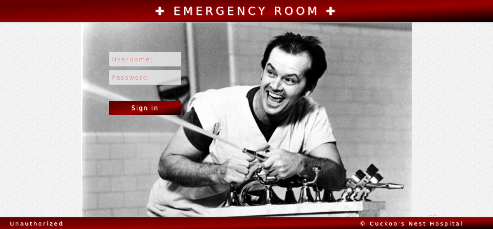

#### Emergency Room

###### Clone the repository and initialize the submodules:
1) `git clone git@github.com:mimly/the-emergency-room-spring.git`
2) `cd the-emergency-room-spring && git submodule update --init`

###### Install all dependencies and build the client:
3) `cd client && npm install && npm run build`

###### Set up a PostgreSQL database server, create the schemas and tables and load the initial data from the script:
4) `server/src/main/resources/erdb.sql`

###### Build and start the server:
5) `cd server && gradle bootWar && java -jar build/libs/*.war`

###### Enjoy!
